# XMTP 402 Worldstore Agent

## what is it?
Demonstration of an XMTP bot that enables crypto-powered Amazon purchases through the x402 payment protocol and Crossmint's headless checkout APIs.

- Supported Network: Base (Sepolia & Mainnet)
- Supported Currency: USDC (`0x036CbD53842c5426634e7929541eC2318f3dCF7e` on Base Sepolia and `0x833589fCD6eDb6E08f4c7C32D4f71b54bdA02913` on Base Mainnet)
- **Storage**: Redis for high-performance data management with filesystem fallback
- Tech Stack
  - Client: XMTP
  - Bot framework: Langgraph
  - Storage: Redis with JSON search capabilities
  - Backend: custom facilitator + crossmint API wrapper; returns 402 for `/order` API and calls Crossmint's APIs internally

## Redis Integration

The bot now uses Redis for enhanced performance and scalability:

### **Benefits**
- **In-memory performance** for faster user profile and order operations
- **Atomic operations** preventing race conditions in order updates
- **JSON document queries** for complex user data searches
- **TTL support** for conversation state caching
- **Search indexes** for user analytics and management
- **Horizontal scaling** capabilities

### **Storage Structure**
```
Redis Keys:
- user:{inboxId}           # User profile JSON documents
- xmtp:{clientKey}:{data}  # XMTP client data
- conversation:{inboxId}   # Cached conversation state (TTL: 1h)
- activity:{inboxId}:{date} # User activity tracking (TTL: 7d)
```

### **Environment Variables**
```bash
# Redis Configuration
REDIS_HOST=localhost
REDIS_PORT=6379
REDIS_PASSWORD=           # Optional
REDIS_DB=0               # Default database
```

### **Installation Options**

**Option 1: Docker (Recommended)**
```bash
# Run Redis Stack with all modules
docker run -d --name redis-stack -p 6379:6379 redis/redis-stack:latest

# Verify it's running
redis-cli ping  # Should return PONG
```

**Option 2: Local Installation**
```bash
# macOS
brew install redis
brew services start redis

# Ubuntu/Debian
sudo apt update && sudo apt install redis-server
sudo systemctl start redis-server
```

**Note:** For full features (JSON documents, search indexes), Redis Stack is required. Standard Redis will work with basic functionality but without advanced search features.

### **Migration**
The bot automatically migrates existing filesystem data to Redis on startup. Manual migration is also available:

```bash
# Migrate filesystem data to Redis
pnpm run migrate

# Rollback to filesystem (if needed)
pnpm run migrate:rollback
```

### **Fallback Behavior**
If Redis is unavailable, the bot gracefully falls back to filesystem storage, ensuring continuous operation.

## under the hood
- the bot has a deterministic wallet generated per user
- before being able to do anything the bot requires the user to set their: name, email, shipping address
- the system uses a unified shopping agent that handles all user interactions through specialized tools
- after deciding on a product (either searching or directly providing an ASIN code)
- the bot queries the x402 server (worldstore API endpoint)
  - makes initial POST to `/api/orders` with order details
  - receives a 402 Payment Required status
  - extracts payment requirements from the response
- the bot generates an EIP-712 signature for USDC authorization
  - creates `TransferWithAuthorization` signature using user's deterministic wallet
  - encodes payment payload with signature and authorization details
- the bot retries the order request with `X-PAYMENT` header containing the encoded payment
- the **x402 facilitator** processes the payment and completes the order
- the user gets an orderid that they can query to check order status

## available tools:
- **Profile Management**: `edit_profile`, `read_profile`
- **Shopping**: `search_product`, `order_product`
- **Order Tracking**: `get_user_order_history`, `get_order_status`
- **Onchain Operations**: GOAT SDK tools for wallet interactions

## workflow diagram

```mermaid
graph TD
    START["🚀 Bot Startup"] --> REDIS_INIT["🔴 Initialize Redis"]
    REDIS_INIT --> REDIS_CHECK{Redis Connected?}

    REDIS_CHECK -->|✅ Yes| DATA_CHECK{Existing Data?}
    REDIS_CHECK -->|❌ No| FILESYSTEM_FALLBACK["📁 Fallback to Filesystem"]

    DATA_CHECK -->|Found| AUTO_MIGRATE["🔄 Auto-migrate to Redis"]
    DATA_CHECK -->|None| REDIS_READY["✅ Redis Ready"]

    AUTO_MIGRATE --> BACKUP["💾 Backup Original Files"]
    BACKUP --> MIGRATE_PROFILES["👤 Migrate User Profiles"]
    MIGRATE_PROFILES --> CREATE_INDEXES["🔍 Create Search Indexes"]
    CREATE_INDEXES --> VERIFY["✅ Verify Migration"]
    VERIFY --> REDIS_READY

    FILESYSTEM_FALLBACK --> CREATE_DIRS["📂 Create Directories"]
    CREATE_DIRS --> FILESYSTEM_READY["📁 Filesystem Ready"]

    REDIS_READY --> INIT_XMTP["📡 Initialize XMTP Client"]
    FILESYSTEM_READY --> INIT_XMTP

    INIT_XMTP --> load_profile[Load User Profile]
    load_profile --> create_agent[Create Agent]
    create_agent --> shopping_node[Shopping Agent Node]

    shopping_node --> message_receive[Receive XMTP Message]
    message_receive --> message_filter{Filter Message}
    message_filter -->|Valid| sync_conversation[Sync Conversation]
    message_filter -->|Invalid| END

    sync_conversation --> invoke_agent[Invoke LangGraph Agent]

    invoke_agent --> profile_tools[Profile Management Tools]
    invoke_agent --> shopping_tools[Shopping Tools]
    invoke_agent --> order_tools[Order Processing Tools]
    invoke_agent --> goat_tools[GOAT SDK Tools]

    order_tools --> X402_Flow

    subgraph X402_Flow ["💳 x402 Payment Flow"]
        initial_request[POST /api/orders<br/>- Send order details]
        payment_required[Receive 402<br/>- Extract payment requirements]
        generate_signature[Generate EIP-712 Signature<br/>- USDC TransferWithAuthorization<br/>- Use deterministic wallet]
        retry_payment[Retry with X-PAYMENT<br/>- Include encoded payload<br/>- Complete order]

        initial_request --> payment_required
        payment_required --> generate_signature
        generate_signature --> retry_payment
    end

    profile_tools --> send_response[Send Response]
    shopping_tools --> send_response
    order_tools --> send_response
    goat_tools --> send_response

    send_response --> END

    %% Storage Integration
    subgraph Redis_Storage ["🔴 Redis Storage"]
        user_profiles_redis[User Profiles<br/>JSON Documents with Search]
        xmtp_data_redis[XMTP Client Data<br/>Key-Value with TTL]
        conversation_cache[Conversation Cache<br/>1h TTL]
        activity_tracking[Activity Analytics<br/>7d TTL]
    end

    subgraph Filesystem_Storage ["📁 Filesystem Fallback"]
        user_profiles_fs[User Profile JSON Files<br/>.data/user-profiles/]
        xmtp_data_fs[XMTP SQLite DBs<br/>.data/xmtp/]
    end

    REDIS_READY -.-> Redis_Storage
    FILESYSTEM_READY -.-> Filesystem_Storage

    %% Styling
    classDef mainFlow fill:#e1f5fe
    classDef xmtpFlow fill:#e8f5e8
    classDef toolsFlow fill:#fff3e0
    classDef paymentFlow fill:#fce4ec
    classDef redisFlow fill:#ffebee
    classDef filesystemFlow fill:#f3e5f5

    class START,REDIS_INIT,load_profile,create_agent,shopping_node,END mainFlow
    class message_receive,message_filter,sync_conversation,invoke_agent,send_response xmtpFlow
    class profile_tools,shopping_tools,order_tools,goat_tools toolsFlow
    class initial_request,payment_required,generate_signature,retry_payment paymentFlow
    class REDIS_CHECK,AUTO_MIGRATE,BACKUP,MIGRATE_PROFILES,CREATE_INDEXES,VERIFY,REDIS_READY,Redis_Storage redisFlow
    class FILESYSTEM_FALLBACK,CREATE_DIRS,FILESYSTEM_READY,Filesystem_Storage filesystemFlow
```

