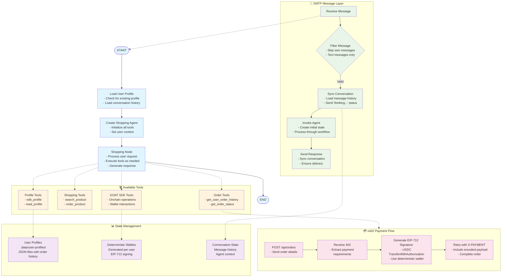

# XMTP 402 Worldstore Agent

## what is it?
Demonstration of an XMTP bot that enables crypto-powered Amazon purchases through the x402 payment protocol and Crossmint's headless checkout APIs.

- Supported Network: Base (Sepolia & Mainnet)
- Supported Currency: USDC (`0x036CbD53842c5426634e7929541eC2318f3dCF7e` on Base Sepolia and `0x833589fCD6eDb6E08f4c7C32D4f71b54bdA02913` on Base Mainnet)
- Tech Stack
  - Client: XMTP
  - Bot framework: Langgraph
  - Backend: custom facilitator + crossmint API wrapper; returns 402 for `/order` API and calls Crossmint's APIs internally

## under the hood
- the bot has a deterministic wallet generated per user
- before being able to do anything the bot requires the user to set their: name, email, shipping address
- the system uses a unified shopping agent that handles all user interactions through specialized tools
- after deciding on a product (either searching or directly providing an ASIN code)
- the bot queries the x402 server (worldstore API endpoint)
  - makes initial POST to `/api/orders` with order details
  - receives a 402 Payment Required status
  - extracts payment requirements from the response
- the bot generates an EIP-712 signature for USDC authorization
  - creates `TransferWithAuthorization` signature using user's deterministic wallet
  - encodes payment payload with signature and authorization details
- the bot retries the order request with `X-PAYMENT` header containing the encoded payment
- the **x402 facilitator** processes the payment and completes the order
- the user gets an orderid that they can query to check order status

## available tools:
- **Profile Management**: `edit_profile`, `read_profile`
- **Shopping**: `search_product`, `order_product`
- **Order Tracking**: `get_user_order_history`, `get_order_status`
- **Onchain Operations**: GOAT SDK tools for wallet interactions

## workflow diagram

